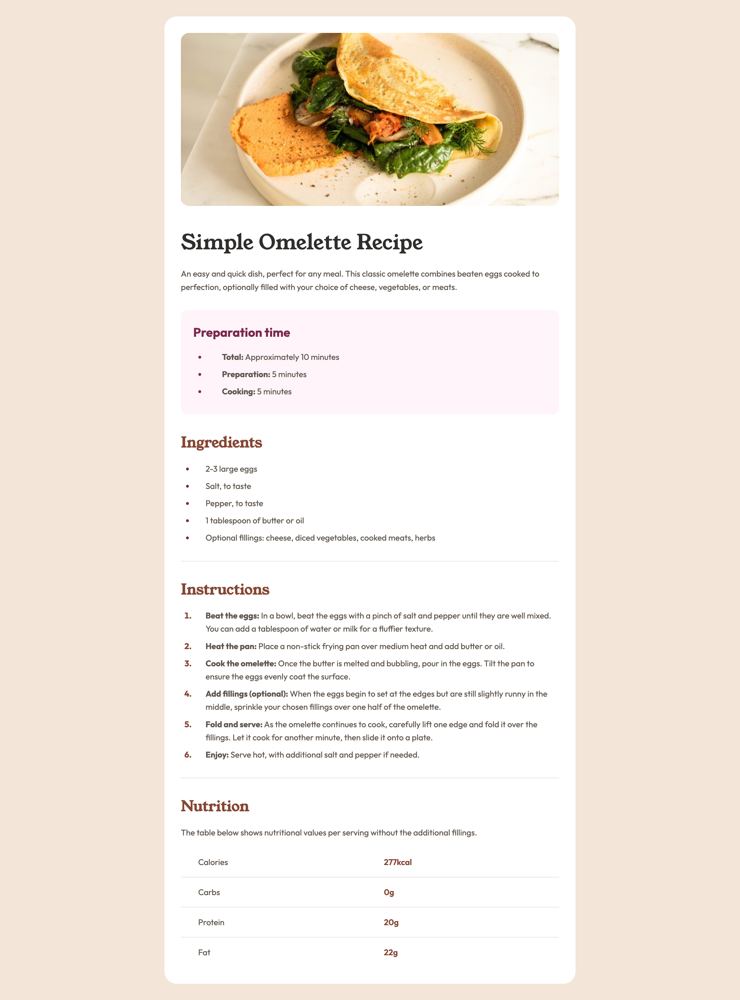

# Frontend Mentor - Recipe Page Solution

This is a solution to the [Recipe page challenge on Frontend Mentor](https://www.frontendmentor.io/challenges/recipe-page-KiTsR8QQKm).

## Table of contents

- [Overview](#overview)
  - [The challenge](#the-challenge)
  - [Screenshot](#screenshot)
  - [Links](#links)
- [My process](#my-process)
  - [Built with](#built-with)
  - [What I learned](#what-i-learned)

---

## Overview

### The challenge

Users should be able to:

- View the optimal layout for the recipe page depending on their device's screen size.
- Read through and follow the recipe instructions seamlessly.

### Screenshot

### Links

- **Solution URL**: [Add your solution URL here](#)
- **Live Site URL**: [https://vanessa-ayer.github.io/recipe-page/](#)

---

## My process

### Built with

- Semantic **HTML5** markup
- **CSS** custom properties
- **Mobile-first** workflow

### What I learned

During this project, I focused on creating clear visual hierarchy and using simple layouts that adapt well to different screen sizes.
